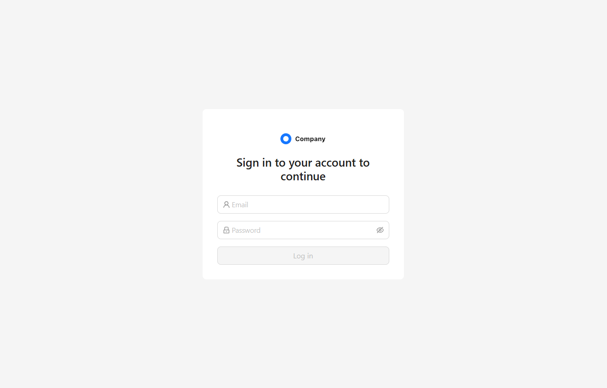

# 🧩 React Login Form - Mocked API Login Demo

A simple and elegant authentication form built with **React + TypeScript + Ant Design**, using **React Query** for API calls and **Mock Service Worker (MSW)** to simulate backend authorization.

## 🚀 Features

- ✅ **Login Form** built with Ant Design (`Form`, `Input`, `Button`)
- 🔐 **Email + Password Validation**
- 🔁 **React Query** for async API interaction
- 🧪 **MSW (Mock Service Worker)** for mocked backend
- ⚡ Built with **Vite**

## 📷 Demo



Try this project online:  
[](login-form-vert-delta.vercel.app)

## 📦 Tech Stack

| Technology | Description |
|-------------|-------------|
| **React** | UI framework |
| **Vite** | Fast development & build tool |
| **Ant Design** | UI components |
| **React Query** | Data fetching and caching |
| **MSW (Mock Service Worker)** | API mocking |
| **TypeScript** | Static typing |

## 🧰 Installation & Setup

### 1️⃣ Clone the repository
```bash
git clone https://github.com/acidless/login-form.git
cd login-form
```

### 2️⃣ Install dependencies
```bash
npm install
```

### 3️⃣ Start the development server
```bash
npm run dev
```

## 📝 License

This project is distributed under the MIT license.
